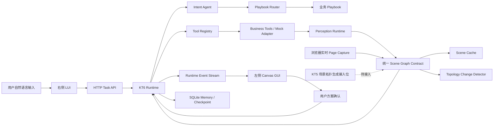

# KT6 意图驱动 UI 联动项目阶段成果汇报

> 汇报日期：2026-07-10  
> 当前阶段：工程原型（PoC）  
> 汇报范围：KT6 界面感知、LUI-GUI 联动、Runtime 编排与人在环执行

## 1. 阶段结论

本阶段已经完成一个由后端 Runtime 驱动的 KT6 可运行工程原型，项目已从“纯前端流程展示”推进到“具备任务编排、思维链路由、事件驱动 UI 联动、人在环执行、运行记忆、界面感知缓存和拓扑变化检测”的完整 PoC 链路。同时，系统已经形成统一 Scene Graph、稳定业务 ID、Scene revision、缓存和变化检测契约，具备接入 KT5 场景化拓扑生成能力的工程基础。

当前系统可以根据用户输入自动选择业务思维链，驱动左侧不规则 Canvas 拓扑完成对象定位、指标分析、根因高亮、方案生成、人工确认、动作执行和结果校验。前端不再写死业务流程，而是消费后端 Runtime 产生的事件。

阶段总体判断：

| 维度 | 当前结论 |
|---|---|
| KT6 总体架构 | 已完成并可运行 |
| LUI-GUI 双向联动主链路 | 已完成 |
| 多业务思维链选择 | 已完成两类诊断场景验证 |
| Runtime 状态机与人在环 | 已完成 |
| 任务、事件、检查点和业务记忆 | 已完成本地持久化 |
| 界面感知缓存与拓扑变化检测 | 已完成第一期 |
| 真实页面感知采集 | 已完成第一期：实时 DOM、Canvas 像素和渲染器 Scene 采集 |
| KT5 场景化拓扑生成接入能力 | 接口与运行底座已具备，KT5 生成器尚未接入 |
| 真实业务数据接入 | 尚未接入，当前使用 Mock Adapter |
| 真实 Canvas 视觉模型 | 尚未接入，当前使用结构化 Mock 感知 |
| 真实设备配置下发 | 尚未接入，当前使用 Mock Action |
| 生产化能力 | 尚未开始系统建设 |

因此，本阶段成果应定义为“KT6 Runtime 工程原型完成”，不应表述为生产系统已经交付。

## 2. 阶段目标

本阶段围绕以下关键问题完成架构验证：

1. 业务思维链如何从代码中解耦，并形成可复用、可扩展的业务资产。
2. 用户输入如何自动选择对应思维链，而不是通过页面按钮切换固定场景。
3. LUI 对话与左侧 GUI 页面跳转、拓扑聚焦和执行进度如何保持同步。
4. Runtime、Agent、Playbook、业务工具和 GUI Executor 如何划分职责。
5. 高风险动作如何引入 Human-In-The-Loop、资源锁和执行检查点。
6. 页面变化后如何保持任务上下文，并避免使用过期的 UI 定位和执行方案。
7. 已知界面如何复用感知结果，降低重复感知开销。
8. KT5 生成的场景化拓扑如何复用 KT6 的渲染、缓存、联动和执行能力。

## 3. 当前系统架构



核心原则：

- Agent 负责意图理解、实体抽取、诊断推理和方案解释。
- Playbook 负责沉淀可执行的业务思维链。
- Runtime 负责状态机、上下文、事件、锁、检查点、重规划和执行顺序。
- Tool Registry 负责保持 Playbook 与具体业务接口解耦。
- Perception Runtime 负责将 DOM、Canvas 或业务拓扑转换成统一 Scene Graph。
- KT5 可以绕过既有页面感知，直接按统一契约生成带业务 ID、关系和布局的 Scene Graph。
- 前端只负责呈现 Runtime 状态和执行 UI 原子操作，不负责决定业务链路。

## 4. 已完成的阶段成果

### 4.1 后端 Runtime 主框架

已经实现完整的任务创建、状态流转、事件输出、方案等待、动作执行和结果校验流程。

Runtime 当前覆盖 13 个任务状态：

```text
created -> planning -> waiting_input -> locating -> perceiving
-> reasoning -> waiting_user -> confirming -> executing
-> verifying -> completed / failed

拓扑发生变化时：replanning -> 重新感知和生成方案
```

Runtime 不依赖前端定时动画推进流程，前端通过任务事件接口获取真实状态。

### 4.2 业务思维链 Playbook 化

业务思维链已经从 Runtime 代码中拆出，当前沉淀 4 个可执行 Playbook：

| Playbook | 类型 | 作用 |
|---|---|---|
| `user_experience_assurance` | 诊断 | 用户网速慢体验保障 |
| `ap_offline_diagnosis` | 诊断 | AP 离线排障 |
| `rf_optimization` | 动作 | 射频调优执行与校验 |
| `poe_port_recovery` | 动作 | PoE 端口恢复与在线校验 |

新增场景时可以通过增加 Playbook、Intent 规则和 Tool Adapter 扩展，不需要复制一套前端页面流程。

### 4.3 用户输入驱动的思维链路由

系统已经支持根据用户输入选择对应业务思维链：

```text
“用户张三昨天上午9:00反馈网速慢，帮忙看下是啥原因”
  -> 用户体验保障 Playbook

“AP3 昨晚一直离线，帮我看下”
  -> AP 离线排障 Playbook
```

动作类 Playbook 不参与首轮诊断路由，只能由诊断方案和用户确认触发，避免用户输入未经诊断直接进入设备操作。

### 4.4 必要信息校验与澄清

每个 Playbook 声明自身所需槽位，Runtime 在操作 GUI 前统一校验。

例如用户只输入：

```text
昨天上午9:00反馈网速慢，帮忙看下是啥原因
```

系统会进入 `waiting_input`，提示缺少用户姓名或账号，不会提前定位张三或执行后续业务操作。

用户只输入“张三”时，也不会默认推断为网速慢场景，而是提示缺少故障现象。

### 4.5 LUI-GUI 事件驱动联动

当前已实现以下 GUI 原子操作：

- 捕获业务 Canvas。
- 加载拓扑数据。
- 生成 Scene Graph 和候选元素框。
- 绑定用户、AP 和业务对象 ID。
- 聚焦和高亮目标节点。
- 高亮根因关系和同频干扰关系。
- 切换诊断、执行和验证视图。
- 同步策略生成、策略下发和结果校验进度。
- 清除故障态并显示恢复完成态。

右侧每个 Runtime 事件都能对应左侧明确的画面状态，避免出现右侧文字继续推进、左侧空白或停留在错误页面的情况。

### 4.6 不规则 Canvas 拓扑联动

左侧拓扑使用 Canvas 绘制，节点本身不是普通 DOM 元素。系统通过统一 Scene Graph 保存：

- 节点业务 ID、类型、标签和坐标。
- AP、用户、交换机等对象绑定。
- 有线链路、接入关系和同频干扰关系。
- 视觉候选框和识别置信度。
- 世界坐标与页面显示坐标。

当前提供 DOM 感知和 Canvas 感知两条适配路径，并通过 Hybrid Perception 统一输出结构。

### 4.7 Human-In-The-Loop 执行

高风险或中风险操作不会在诊断完成后自动执行。

当前流程为：

```text
诊断完成
-> Runtime 进入 waiting_user
-> 右侧生成方案
-> 用户点击一键执行或确认执行
-> Runtime 检查任务状态和场景版本
-> 建立 checkpoint 和资源锁
-> 执行动作 Playbook
-> 校验结果
-> 释放资源锁
```

当前已验证射频调优和 PoE 端口恢复两类人在环动作。

### 4.8 Runtime 记忆和运行轨迹

后端已经使用 SQLite 持久化：

| 数据 | 内容 |
|---|---|
| Tasks | 用户输入、任务状态、上下文和资源锁 |
| Events | Runtime、Chat、UI、Step、Solution 事件 |
| Checkpoints | 高风险操作执行前上下文快照 |
| Memories | 已完成故障及其根因和恢复结果 |

这使当前系统不再只依赖浏览器内存，能够查询历史任务和执行轨迹。

### 4.9 界面感知缓存

本阶段新增版本化 Scene Cache，解决同一界面反复执行完整感知的问题。

缓存判断包含：

- 界面版本、站点、楼层和 Canvas 尺寸形成模板指纹。
- 节点、链路和业务绑定形成内容指纹。
- 每份 Scene Graph 持有独立 revision。
- 任务聚焦、高亮和执行进度作为 Task Overlay，不写入共享基础缓存。

当前缓存状态包括：

| 状态 | 含义 |
|---|---|
| `MISS` | 未发现已知界面，执行完整感知并写入缓存 |
| `HIT` | 界面与拓扑内容均未变化，直接复用 Scene Graph |
| `INCREMENTAL` | 界面模板未变，但拓扑内容发生变化，生成新 revision |

缓存保存在 `runtime_data/kt6_scene.sqlite3`，页面可以显示缓存状态、Scene revision 和本次感知耗时。

### 4.10 拓扑变化检测与方案失效

Topology Change Detector 当前可以识别：

- 节点新增和删除。
- 节点坐标移动。
- 节点属性或状态变化。
- 链路新增和删除。
- 同频关系变化。

Runtime 在用户执行方案前重新校验 Scene revision：

| 变化类型 | Runtime 行为 |
|---|---|
| 当前目标未变化 | 继续执行 |
| 无关节点变化 | 更新 revision，当前任务继续 |
| 目标节点仅移动 | 重新绑定坐标后继续执行 |
| 当前 AP、用户或关联链路变化 | 撤销旧方案，进入 `replanning` |
| 页面模板变化 | 放弃旧定位，执行完整重新感知 |

这项能力把界面缓存、上下文连续性和多任务执行安全连接起来，避免基于过期页面状态下发操作。

### 4.11 KT5 场景化拓扑生成接入基础

当前张三网速慢拓扑仍然来自 `data/mock_topology.json` 的固定节点、链路和坐标，并不是 KT5 根据意图动态生成的拓扑。但现有工程已经具备接入 KT5 的公共底座：

| 已具备能力 | 对 KT5 的价值 |
|---|---|
| `objects + links` 拓扑协议 | KT5 输出相同协议即可复用当前 Canvas Renderer |
| 稳定 `business_id` | KT5 节点可以与真实用户、AP 和设备绑定 |
| Scene Graph | 感知页面和生成拓扑可以使用同一语义模型 |
| `scene_key + scene_revision` | KT5 生成结果可以进行版本管理 |
| Scene Cache | 相同意图和数据下可以复用已生成拓扑 |
| Topology Change Detector | 业务数据变化后可以增量更新生成拓扑 |
| Task Overlay | 不同任务可以复用基础拓扑，但保持独立聚焦和高亮 |
| Runtime Event Stream | KT5 生成拓扑可以继续使用 KT6 的聚焦、执行和验证事件 |

后续接入 KT5 时，不需要重新建设一套前端和 Runtime，而是增加 KT5 Topology Adapter 和 Scene Orchestrator：

```text
用户意图和任务上下文
-> Scene Orchestrator 判断 existing_ui / generated_scene / hybrid
-> KT5 根据业务数据生成场景节点、关系和布局
-> 注册到现有 Scene Store
-> KT6 驱动聚焦、高亮、交互和执行
```

尚未完成的 KT5 能力包括：

- 根据意图动态裁剪相关节点和关系。
- 根据诊断目标选择层次、辐射或因果布局策略。
- KT5 生成服务或 SDK 的真实调用。
- 生成拓扑节点点击后触发 GUI 到 LUI 的反向事件。
- 诊断使用生成拓扑、执行跳转原生页面的 Hybrid Scene 策略。

因此，当前准确结论是“具备 KT5 接入能力”，不是“已经实现 KT5 场景化拓扑生成”。

### 4.12 真实页面感知第一期

当前已建立浏览器到 Runtime 的真实页面采集链路：

```text
任务创建或动作执行前
-> 浏览器实时采集左侧页面 DOM/ARIA
-> 调用 canvas.toDataURL() 捕获真实 Canvas 像素
-> 读取可选 Canvas 渲染器 Scene Adapter
-> POST /api/perception/captures
-> 后端持久化截图和 Capture 元数据
-> 生成 page_capture_id 和统一 Scene Graph
-> Runtime 使用现场快照完成定位与执行前校验
```

当前页面验证结果：

- 任务上下文和 `scene_ref` 均保存真实 `page_capture_id`。
- Canvas PNG 截图实际保存到 `runtime_data/page_captures/`。
- 当前拓扑节点语义来自页面实时渲染器适配器，感知模式为 `canvas_renderer_adapter`。
- 执行方案前会再次采集页面；页面未变化时显示 `LIVE HIT` 并复用 Scene revision。
- 陌生 Canvas 如果只有像素、没有 DOM 或渲染器语义，将明确标记 `requires_vision_model=true`，不会伪造节点识别结果。

该阶段完成的是“真实采集与语义适配框架”。截图 OCR、目标检测和多模态视觉模型尚未接入，外部业务页面也需要安装采集脚本、浏览器扩展或页面 Adapter 后才能使用。

## 5. 已打通的业务场景

### 5.1 用户网速慢诊断与射频调优

```text
用户输入问题
-> 自动选择用户体验保障 Playbook
-> 定位张三所在拓扑
-> 绑定张三与 AP1
-> 分析用户指标和关联 AP
-> 判断 AP1 同频邻居干扰
-> 左侧高亮 AP1 和干扰关系
-> 右侧生成射频调优及信道集方案
-> 用户点击一键执行
-> Runtime 建立检查点和资源锁
-> 左侧同步策略生成、下发和生效校验
-> AP1 和张三体验恢复正常
```

### 5.2 AP 离线诊断与 PoE 恢复

```text
用户输入 AP3 离线问题
-> 自动选择 AP 离线排障 Playbook
-> 定位 AP3 所在拓扑
-> 查询 AP 心跳和交换机端口
-> 判断根因为 PoE 供电异常
-> 左侧保持 AP3 故障高亮
-> 右侧生成重启 PoE 和现场检查方案
-> 用户确认执行
-> 左侧同步 PoE 重启和心跳恢复
-> AP3 恢复在线
```

### 5.3 输入信息缺失

```text
输入缺少用户或 AP 编号
-> Playbook 路由
-> required_slots 校验
-> waiting_input
-> 提示补充信息
-> 不触发任何 GUI 定位和业务执行
```

## 6. 阶段交付物

### 6.1 工程代码

| 目录 | 数量 | 主要内容 |
|---|---:|---|
| `kt6_backend/` | 15 个模块 | Runtime、Agent、Router、Memory、Page Perception、Cache、Change Detector |
| `playbooks/` | 4 个文件 | 两个诊断 Playbook、两个动作 Playbook |
| `data/` | 8 份数据 | 当前业务场景 Mock 数据 |
| `demo/` | 3 个文件 | 事件驱动的 LUI-GUI 交互界面 |
| `tests/` | 7 个模块 | Runtime、路由、感知、页面采集、缓存、记忆和 Playbook 测试 |

### 6.2 设计文档

- `DESIGN.md`：KT6 总体设计、Runtime 和 Agent 分工、跨 KT 协作、多任务与原子操作。
- `KT6_SCENARIO_FLOW.md`：张三网速慢场景的完整业务链和左右联动细化。
- `PROJECT_STATUS.md`：项目基础状态说明。
- `README.md`：工程结构、运行方式、API 和 Mock 替换入口。

### 6.3 Runtime API

当前提供：

```text
GET  /api/health
GET  /api/playbooks
GET  /api/playbooks/{scenario_id}
GET  /api/tools
GET  /api/topology
GET  /api/perception/cache
POST /api/tasks
GET  /api/tasks
GET  /api/tasks/{task_id}
GET  /api/tasks/{task_id}/events
POST /api/tasks/{task_id}/actions
GET  /api/memory
```

## 7. 工程验证结果

截至本次汇报：

| 指标 | 结果 |
|---|---:|
| 可执行 Playbook | 4 个 |
| 注册业务工具 | 15 个 |
| Runtime 状态 | 13 个 |
| 自动化测试 | 21 项全部通过 |
| 业务诊断场景 | 2 个 |
| 动作执行场景 | 2 个 |
| 浏览器控制台错误 | 0 |
| 服务健康检查 | 通过 |

测试覆盖的关键行为包括：

- 网速慢场景路由到用户体验保障。
- AP 离线路由到 AP 离线排障。
- 动作 Playbook 不参与首轮诊断选择。
- 缺少必要槽位时不操作 GUI。
- 射频调优执行完成并释放锁。
- PoE 恢复执行完成并恢复 AP 在线。
- 相同界面跨任务聚焦复用缓存。
- 节点移动和链路删除生成增量 revision。
- 目标拓扑变化时旧方案失效并重新规划。
- 目标仅移动时重新绑定后继续执行。
- 浏览器实时 Canvas 截图落盘并生成 Page Capture。
- Runtime 使用 `page_capture_id`，而不是重新读取固定拓扑。
- 未知 Canvas 正确标记为需要视觉模型，不生成虚假业务绑定。

## 8. 当前 Mock 范围和真实边界

当前工程的 Runtime 流程、状态机、事件链路、SQLite 持久化、Scene Cache 和 Topology Diff 均为真实后端实现，但业务输入和设备执行仍存在以下 Mock：

| 能力 | 当前实现 | 真实接入要求 |
|---|---|---|
| 用户体验指标 | JSON Mock | 对接用户体验保障平台 API |
| 用户关联 AP | JSON Mock | 对接终端接入和认证数据 |
| AP 射频指标 | JSON Mock | 对接无线控制器或数据平台 |
| AP/交换机/PoE 状态 | JSON Mock | 对接网管和交换机接口 |
| 射频策略生成与下发 | Mock Tool | 对接真实策略服务和下发接口 |
| Intent Agent | 关键词与规则 | 接入正式 NLU/LLM 和实体服务 |
| DOM 感知 | 已实现当前页面实时 DOM/ARIA 采集 | 部署到真实业务页面并扩展语义标注 |
| Canvas 像素采集 | 已通过 `canvas.toDataURL()` 实时截图并持久化 | 增加脱敏、保留策略和跨域页面采集能力 |
| Canvas 节点语义 | 当前页面使用实时渲染器 Adapter | 陌生 Canvas 接入 OCR、检测模型或多模态视觉模型 |
| 拓扑变化来源 | Scene Graph 数据比较 | 接入 WebSocket、消息总线或真实截图差分 |
| KT5 场景化拓扑生成 | 已具备统一 Scene Graph 和接入底座 | 对接 KT5 生成器、布局策略和交互协议 |
| 资源锁 | 单进程内存锁 | 接入分布式锁和统一任务调度 |

因此，目前系统已经证明“架构和运行机制可行”，但尚不能证明真实视觉识别准确率、真实设备执行成功率和生产并发能力。

## 9. 当前主要风险

| 风险 | 影响 | 应对方向 |
|---|---|---|
| 真实业务页面尚未接入 | 无法验证页面适配成本 | 尽快选定一个真实页面完成端到端接入 |
| Canvas 视觉模型尚未接入 | 截图可获取，但陌生 Canvas 无法识别节点语义 | 先接拓扑引擎数据，视觉模型作为降级路径 |
| KT5 输入输出协议尚未最终确定 | 可能导致场景生成结果无法直接被 KT6 消费 | 优先确定统一 Scene Graph 和 Scene Event 协议 |
| Intent 解析仍为规则 | 长尾表达和多轮对话能力有限 | 接入 LLM 并保留 required_slots 硬校验 |
| 当前锁为单进程 | 多实例和多任务冲突不可控 | 引入任务队列、分布式锁和幂等键 |
| 真实动作接口尚未接入 | 无法验证配置下发闭环 | 先接 Dry Run 和沙箱环境，再开放生产动作 |
| 缺少统一鉴权和审计 | 不满足生产安全要求 | 对接用户身份、权限、审计日志和审批流 |
| 缺少监控与性能基线 | 无法评估稳定性 | 增加指标、链路追踪和压测方案 |

## 10. 下一阶段建议计划

### 里程碑一：接入真实只读业务数据

目标：用真实接口替换网速慢场景中的用户、AP、射频和拓扑 Mock 数据。

交付结果：

- 一个真实用户查询接口。
- 一个真实用户关联 AP 接口。
- 一套真实 AP 射频指标。
- 一个真实拓扑页面或拓扑数据接口。
- 保持现有 Tool 名称和 Playbook 不变。

### 里程碑二：接入 KT5 场景化拓扑生成

目标：在现有 Scene Graph 和 Runtime 上接入 KT5，为诊断任务动态生成场景拓扑。

交付结果：

- 确定 KT5 到 KT6 的 Scene Graph 输入输出协议。
- 新增 Scene Orchestrator，支持 `existing_ui / generated_scene / hybrid` 三种模式。
- 张三网速慢场景根据意图动态生成用户、AP、接入链路和干扰邻居子图。
- KT5 输出稳定业务 ID、数据来源、布局策略和可交互动作。
- 生成拓扑复用现有缓存、revision、变化检测和 Canvas Renderer。
- 诊断使用生成拓扑，真实操作跳转原生页面完成执行前校验。

### 里程碑三：深化真实页面感知与外部页面接入

目标：将已经跑通的实时采集框架部署到真实业务页面，并补充陌生 Canvas 视觉识别能力。

交付结果：

- 将 Page Capture Sensor 或浏览器扩展接入真实业务页面。
- DOM 页面：补充 Accessibility Tree、业务 ID 和页面操作语义绑定。
- Canvas 页面：复用真实截图和坐标变换，接入 OCR/节点检测或多模态视觉模型。
- 感知结果进入现有 Scene Graph、缓存和变化检测链路。
- 建立识别准确率和响应延迟测试集。

### 里程碑四：接入受控执行闭环

目标：从只读诊断推进到受控操作。

交付结果：

- 射频策略 Dry Run。
- PoE 重启沙箱或测试设备接口。
- 权限校验、HITL 审批、幂等、回滚和审计。
- 执行前后真实状态校验。

### 里程碑五：增强 Runtime 协作能力

目标：支持复杂交互和并发任务。

交付结果：

- 多轮槽位补全，不要求用户重新输入完整问题。
- 多任务队列和分布式资源锁。
- 任务暂停、恢复、取消和人工修正。
- Runtime 失败重试、超时、补偿和回放。
- 与 KT1、KT2、KT3、KT4、KT5 的标准事件协议。

### 里程碑六：生产化准备

目标：形成可部署、可观测、可验收的系统版本。

交付结果：

- 企业鉴权、租户隔离和权限控制。
- 日志、指标、追踪和告警。
- 数据库迁移和高可用部署。
- 安全评审、性能测试和故障演练。
- 真实业务场景验收报告。

## 11. 下一阶段所需外部输入

为避免后续继续停留在 Mock，需要项目组明确提供：

1. 一个可访问的真实业务页面及测试账号。
2. 拓扑、用户体验、AP、交换机和射频数据接口说明。
3. 真实页面使用的前端图形框架及是否可以读取底层图数据。
4. 射频调优和 PoE 操作的测试或沙箱接口。
5. 用户身份、权限、审批和审计要求。
6. 场景验收数据集及成功率、延迟等指标口径。
7. KT5 场景拓扑生成服务、布局策略和 Scene Graph 输出协议。
8. KT1-KT5 的输入输出协议和负责人。

这些输入是项目从工程 PoC 进入真实业务联调的前置条件。

## 12. 演示方式

启动项目：

```powershell
python main.py
```

浏览器访问：

```text
http://127.0.0.1:8787/
```

推荐演示顺序：

1. 展示全量 Canvas 拓扑和 Scene Cache 状态。
2. 输入张三网速慢问题，展示自动选择用户体验保障思维链。
3. 展示张三、AP1 和同频邻居在左侧同步聚焦。
4. 展示右侧诊断步骤和方案生成，强调此时尚未自动执行。
5. 点击一键执行，展示 HITL、执行进度和恢复校验。
6. 重置后输入 AP3 离线问题，展示第二条 Playbook。
7. 输入缺少用户信息的问题，展示 required_slots 拦截。

## 13. 建议汇报口径

建议表述：

> 本阶段完成了 KT6 LUI-GUI 协同 Runtime 的可运行工程原型。系统已经实现输入驱动的业务思维链选择、左右界面事件联动、人在环执行、运行记忆、界面缓存和拓扑变化重规划，并打通用户网速慢和 AP 离线两个业务场景。浏览器已经能够实时采集 DOM、Canvas 像素和渲染器 Scene，并通过 page_capture_id 驱动 Runtime。同时，系统已经形成统一 Scene Graph、Scene revision 和事件协议，具备接入 KT5 场景化拓扑生成能力。当前 KT5 生成器、陌生 Canvas 视觉模型、真实业务数据和设备操作仍待接入。

不建议表述：

> KT6 已经完成生产交付，已经具备真实 Canvas 视觉识别和真实设备自动操作能力。

同样不建议表述：

> KT5 场景化拓扑生成已经完成，当前张三网速慢拓扑由 KT5 动态生成。

## 14. 阶段总结

本阶段最核心的成果不是完成了一个前端页面，而是建立了一个可以继续接入真实能力的 KT6 Runtime 主框架：

```text
用户输入
-> 意图和思维链选择
-> Runtime 状态与上下文
-> 界面感知和业务对象绑定
-> 实时 Page Capture 与现场快照校验
-> GUI 原子操作
-> 业务诊断
-> 人在环方案执行
-> 结果校验
-> 记忆、缓存与拓扑变化重规划
-> KT5 场景化拓扑生成接入位
```

当前项目已经具备进入真实业务联调和 KT5 能力接入阶段的工程基础。下一阶段是否能够形成业务价值，主要取决于实时采集框架能否部署到目标业务页面，以及 KT5 生成服务、真实数据接口、陌生 Canvas 视觉模型和受控执行接口能否按计划接入。
