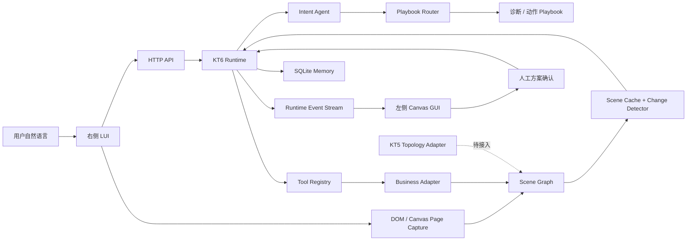

# KT6 意图驱动 LUI-GUI 联动 Runtime

本项目是面向无线网络运维场景的 **KT6 工程原型（PoC）**。它通过后端 Runtime 将用户自然语言意图、业务 Playbook、页面感知、Canvas 拓扑联动和人在环执行串成一条可运行链路。

这不是纯前端动画演示：前端负责采集页面和呈现事件，后端负责意图路由、任务状态、业务步骤、方案授权、资源锁、场景校验、执行结果与运行记忆。

当前阶段结论：**KT6 核心架构和端到端 PoC 已完成，真实业务系统、纯视觉 Canvas 模型和真实设备下发尚未接入。**

## 已实现能力

| 能力 | 当前实现 |
|---|---|
| 自然语言意图路由 | 根据输入自动选择诊断 Playbook，不依赖前端场景按钮 |
| 槽位校验与澄清 | 缺少用户、AP、时间或故障现象时进入 `waiting_input` |
| Runtime 编排 | 任务状态机、上下文、事件流、整本 Playbook 预检、失败处理和重新规划 |
| LUI-GUI 联动 | 右侧步骤驱动左侧 Canvas 定位、高亮、执行进度和恢复状态 |
| Human-In-The-Loop | 诊断完成后由用户确认方案，动作不能绕过授权直接执行 |
| 执行安全 | `solution_id`、场景版本、资源锁、执行前 checkpoint 与动作后置条件校验 |
| 步骤扩展 | 按诊断/动作 phase 和 step ID 注册处理器，校验步骤 type、state 与必填字段 |
| 页面感知 | DOM/ARIA、Canvas 截图、渲染器 Scene、拓扑文本重建及生产 HTTP CanvasVision Adapter |
| 感知缓存 | Scene Graph 缓存、`scene_revision`、`HIT/MISS/INCREMENTAL` |
| 拓扑变化检测 | 节点、位置、链路增删及链路语义属性变化检测；关键变化触发重规划 |
| 运行记忆 | SQLite 持久化任务、事件、检查点、场景和业务处理结果 |
| KT5 接入基础 | 感知拓扑与生成拓扑共用统一 Scene Graph 契约 |
| 自动化测试 | 当前 102 项测试通过 |

## 业务场景

当前已验证两条完整业务链路。

### 用户体验保障

```text
“用户张三昨天上午9:00反馈网速慢，帮忙看下是啥原因”
-> 选择 user_experience_assurance
-> 定位张三及关联 AP1
-> 分析用户、设备和射频指标
-> 判断 AP1 存在同频邻居干扰
-> 生成射频调优方案
-> 用户一键确认
-> 执行 rf_optimization
-> 校验用户体验恢复
```

### AP 离线排障

```text
“AP3 昨晚一直离线，帮我看下”
-> 选择 ap_offline_diagnosis
-> 定位 AP3 及交换机端口
-> 判断 PoE 异常
-> 生成 PoE 端口恢复方案
-> 用户确认执行
-> 执行 poe_port_recovery
-> 校验 AP3 恢复在线
```

## 系统架构



模块职责：

- **Agent**：意图解析、实体抽取、诊断与方案解释。
- **Playbook**：沉淀可配置、可执行、可审计的业务任务链。
- **Runtime**：管理状态、上下文、事件、锁、检查点、授权与重规划。
- **Tool Registry / Adapter**：隔离 Runtime 与具体业务查询、设备操作接口。
- **Page Perception**：把 DOM、Canvas 或渲染器数据转换为统一 Scene Graph。
- **Frontend**：采集当前页面，消费 Runtime 事件并执行可视化原子操作。

## 页面感知现状

前端在创建任务和执行方案前采集当前页面：

```text
浏览器页面
-> 采集 DOM / ARIA / 文本 / 元素边界
-> canvas.toDataURL() 采集真实像素
-> 可选 window.__KT6_PAGE_ADAPTER__ 导出渲染器 nodes / links
-> 可选提交人工 ASCII 或外部 OCR 的结构化拓扑文本
-> POST /api/perception/captures
-> PagePerceptionService 规范化并持久化
-> 统一 Scene Graph + page_capture_id
-> Runtime 定位目标并在执行前重新校验
```

系统按页面开放程度使用不同路径：

| 路径 | 适用页面 | 当前状态 |
|---|---|---|
| DOM 感知 | 按钮、表格、表单等可访问 DOM/ARIA 的页面 | 已完成第一期 |
| Canvas Renderer Adapter | 可以读取图引擎、Store、接口或渲染前 `nodes/edges` 的 Canvas | 当前 Demo 已使用 |
| Topology Text Recognizer | 人工 ASCII 或外部 OCR 已转写出的结构化拓扑文本 | 已完成首个严格样例 |
| Canvas Vision Adapter | 只能获得截图、图片、远程桌面或封闭 Canvas | 生产 HTTP Adapter、严格协议和 CLI 已完成；外部模型服务由环境配置 |

当前 Canvas 截图由浏览器实时采集，但 Demo 中的节点语义主要来自 `window.__KT6_PAGE_ADAPTER__` 暴露的渲染器数据，其底层业务拓扑仍为 Mock。遇到只有像素、没有内部语义的 Canvas 时，后端会明确返回 `requires_vision_model=true`，不会伪造节点绑定；若 `toDataURL()` 失败，则保留采集错误并回退可用 DOM，也不会虚报已有视觉输入。

结构化拓扑文本现在可以重建节点、关系、视觉组、证据和冲突信息，但其 provenance 会被强制标记为非像素、不可执行。文本坐标不能用于 GUI 点击；Runtime 会拒绝 `actionable_grounding=false` 的动作。当前企业拓扑黄金样例稳定识别 22 个设备和 19 条明确关系，详细规则见 [拓扑界面感知测试](TOPOLOGY_PERCEPTION_TEST.md)。

生产图片可以通过 `HTTPTopologyVisionAdapter` 发送给外部 OCR、目标检测或多模态服务，并生成 `elements + relations + semantic_tree`。使用 `KT6_VISION_ENDPOINT`、`KT6_VISION_API_KEY` 和 `KT6_VISION_TIMEOUT_SECONDS` 配置；具体服务契约和 pixels-only 测试命令见 [生产拓扑图片识别接入](PRODUCTION_TOPOLOGY_VISION.md)。视觉业务 ID 未经资产库核验前固定为 analysis-only。

Browser Use 后续可以作为浏览器会话、DOM 获取、截图和通用 GUI 操作底座，但其内置视觉不能单独替代拓扑感知：稳定的节点/链路重建、业务 ID 绑定、跨帧对象一致性和拓扑版本判断仍需要 Renderer Adapter 或专用 Canvas Vision Adapter。

## Scene 缓存与拓扑变化

感知结果按模板指纹和内容指纹管理：

- `MISS`：未知界面，创建首个 Scene revision。
- `HIT`：界面和语义内容未变化，复用已有 Scene Graph。
- `INCREMENTAL`：界面模板相同但拓扑内容变化，创建新 revision。

执行方案前 Runtime 会再次采集并比较场景：

- 当前目标未变化：继续执行。
- 目标仅移动：更新坐标绑定后继续。
- 目标节点、状态或关键链路变化：旧方案失效，进入 `replanning`。
- 页面模板变化：放弃旧定位并重新感知。

并行链路优先使用 `relation_id`、`edge_id` 或 `id` 维持跨 revision 身份，其次使用端口等稳定属性匹配。生产拓扑协议应为多重边提供稳定 `relation_id`；完全同构且无稳定标识的链路只能按确定出现顺序降级匹配。

## 业务 Playbook

业务思维链不写在前端，也不依赖大模型隐藏推理，而是保存在 `playbooks/` 下的声明式文件中。

| Playbook | 类型 | 作用 |
|---|---|---|
| `user_experience_assurance` | 诊断 | 用户网速慢体验保障 |
| `ap_offline_diagnosis` | 诊断 | AP 离线排障 |
| `rf_optimization` | 动作 | 射频调优与结果校验 |
| `poe_port_recovery` | 动作 | PoE 端口恢复与在线校验 |

首次输入只允许路由到诊断 Playbook。动作 Playbook 必须由诊断建议和用户确认触发。Runtime 会在产生业务副作用前预检整本 Playbook；未知步骤、类型不匹配、非法状态或字段缺失都会快速失败。已执行步骤记录在 `context.executed_steps` 中用于审计。

## 快速运行

### 环境要求

- Python 3.10 或更高版本。
- 当前仅使用 Python 标准库，无需安装第三方依赖。
- Chrome、Edge 或其他现代浏览器。

### 启动

在项目根目录执行：

```powershell
python -m kt6_backend.app
```

也可以使用兼容入口：

```powershell
python main.py
# 或
python run_gui.py
```

浏览器访问：

```text
http://127.0.0.1:8787/
```

`127.0.0.1` 表示服务只运行在当前电脑上，`8787` 是本项目 HTTP 服务端口。关闭启动进程后，页面将无法连接。

## API

```text
GET  /api/health
GET  /api/playbooks
GET  /api/playbooks/{scenario_id}
GET  /api/tools
GET  /api/topology
GET  /api/memory?limit={n}

POST /api/perception/captures
GET  /api/perception/captures?limit={n}
GET  /api/perception/captures/{capture_id}
GET  /api/perception/cache

POST /api/tasks
GET  /api/tasks?limit={n}
GET  /api/tasks/{task_id}
GET  /api/tasks/{task_id}/events?since={event_id}
POST /api/tasks/{task_id}/actions
```

创建任务示例：

```powershell
$task = Invoke-RestMethod -Method Post `
  -Uri 'http://127.0.0.1:8787/api/tasks' `
  -ContentType 'application/json' `
  -Body '{"query":"用户张三昨天上午9:00反馈网速慢，帮忙看下是啥原因"}'

Invoke-RestMethod `
  -Uri "http://127.0.0.1:8787/api/tasks/$($task.task_id)/events?since=0"
```

## 数据持久化

运行时会在 `runtime_data/` 下创建本地数据，该目录已被 Git 忽略：

```text
runtime_data/
  kt6_memory.sqlite3          任务、事件、检查点和业务记忆
  kt6_scene.sqlite3           版本化 Scene Cache
  kt6_page_captures.sqlite3   页面采集记录
  page_captures/              Canvas 像素截图
```

## 当前 Mock 边界

`data/` 中仍使用 Mock 数据：

| 文件 | 模拟内容 |
|---|---|
| `mock_topology.json` | 节点、链路、坐标、同频关系和业务 ID |
| `mock_user_experience.json` | 用户体验指标 |
| `mock_associated_device.json` | 用户与 AP 的关联关系 |
| `mock_radio_metrics.json` | AP 射频与干扰指标 |
| `mock_ap_status.json` | AP 在线及故障状态 |
| `mock_switch_port.json` | 交换机端口与 PoE 状态 |
| `mock_rf_strategy.json` | 射频调优策略和执行结果 |
| `mock_negative_checks.json` | 排除项检查结果 |

因此当前真实与模拟边界为：

- Runtime 状态流转、事件、锁、checkpoint、持久化是真实实现。
- DOM、Canvas 像素采集和 Scene 缓存是真实实现。
- Demo 拓扑业务语义、指标、根因输入和设备动作结果仍是 Mock。
- CanvasVision HTTP 接入已经具备，但外部模型服务及准确率验证、企业鉴权、真实设备下发和生产级回滚尚未完成。

接入真实系统时，应保留 Runtime 与 Playbook，替换 `kt6_backend/tools.py` 中的业务适配实现，并通过 `kt6_backend/tool_registry.py` 注册真实工具。

## 项目结构

```text
kt6_backend/
  app.py                       HTTP API、服务工厂和静态页面服务
  runtime.py                   任务状态机与 Playbook 执行器
  agent.py                     IntentParser / Diagnoser 接口与默认实现
  router.py                    意图到诊断 Playbook 的路由
  playbook_loader.py           Playbook JSON 加载
  step_registry.py             步骤处理器注册、字段/type/state 预检
  tool_registry.py             工具注册表
  tools.py                     当前 Mock 业务适配器
  page_perception.py           实时页面采集、持久化和 Scene 规范化
  http_canvas_vision.py        生产 HTTP 视觉 Adapter 与严格输入输出协议
  topology_image_cli.py        pixels-only 图片验收命令行工具
  topology_text_recognizer.py  Unicode 拓扑文本的保守语义重建
  vision_recognition.py        CanvasVision 帧与适配器协议
  perception.py                DOM / Canvas Mock 感知适配器
  perception_runtime.py        Scene 缓存、revision 与外部场景注册
  topology_change_detector.py  拓扑差异检测
  scene_store.py               Scene Graph 持久化
  memory.py                    任务、事件、checkpoint 和业务记忆
  models.py                    Task 与 RuntimeEvent 模型

playbooks/                     诊断和动作任务链
data/                          Mock 业务数据
demo/                          LUI-GUI Web 界面
tests/                         自动化测试
```

## 测试

```powershell
python -m unittest discover -s tests
```

当前覆盖 102 项测试，包括意图路由、缺参澄清、动作授权、Playbook 预检、步骤注册、资源锁、执行后置条件、运行记忆、页面采集失败回退、文本拓扑重建、HTTP Vision 契约/TLS/图片完整性、pixels-only CLI、DOM-like 语义树、不可执行 grounding 门禁、缓存命中、并行链路变化、重新绑定和重新规划。

## 项目文档

- [7.13 阶段简报](7.13.md)
- [阶段成果报告](KT6_STAGE_PROGRESS_REPORT.md)
- [总体设计](DESIGN.md)
- [场景执行细化](KT6_SCENARIO_FLOW.md)
- [拓扑界面感知测试](TOPOLOGY_PERCEPTION_TEST.md)
- [生产拓扑图片识别接入](PRODUCTION_TOPOLOGY_VISION.md)
- [Bug 与架构复核](bug.md)
