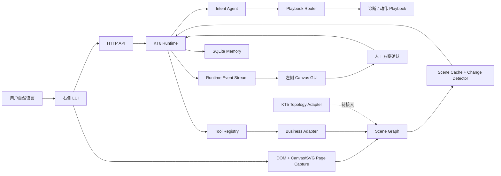

# KT6 意图驱动 LUI-GUI 联动 Runtime

本项目是面向无线网络运维场景的 **KT6 工程原型（PoC）**。它通过后端 Runtime 将用户自然语言意图、业务 Playbook、页面感知、Canvas 拓扑联动和人在环执行串成一条可运行链路。

这不是纯前端动画演示：前端负责采集页面和呈现事件，后端负责意图路由、任务状态、业务步骤、方案授权、资源锁、场景校验、执行结果与运行记忆。

当前阶段结论：**KT6 核心架构、端到端 PoC、三种 Canvas 像素识别驱动，以及 B 组
多源 UI Graph dry-run 规划已完成；`feature/browser-executor` 已固定
`kt6.action-plan.v1` 契约，支持受限自然语言生成可读计划，并由 ScenarioRunner 在每一步
重新采集真实 DOM/CDP/Canvas 后执行 type、click、wait、verify；Chrome Side Panel 会在
用户点击扩展后 attach 当前标签页，并通过本机后端的固定命令中继完成识别与操作；真实业务系统验收、
真实图片准确率评测和真实设备下发尚未完成。**

供其他 Codex 或新开发环境接手时，请同时阅读
[CODEX_HANDOFF.md](./CODEX_HANDOFF.md)；其中记录了当前工作目录、分阶段拓扑链路、
CodeAgentCLI 的 Windows 启动方式、真实图片验证结论、已知限制和下一步建议。

本地运行配置可统一写入根目录 `.env`：复制 `.env.example` 后填写当前方案需要的配置，
启动后端或评测 CLI 时会自动读取；已在终端、服务或密钥系统设置的同名环境变量优先。
`.env` 已被 Git 忽略，`.env.example` 只保存字段模板，不能写入真实密钥。

多源 UI Graph、Playwright/CDP 只读采集和内部 GLM5.1 操作规划的设计、安全边界与
使用方式见 [docs/ui-graph-architecture.md](./docs/ui-graph-architecture.md)。该路径参考
TextFlow 的中间文本图分层思想，当前不包含 OmniParser。

UI Graph 新方案保留在 `ui-graph-textflow-cdp`；现有 Chrome 扩展执行试验继续隔离在
`feature/browser-executor`。测试区环境准备、CDP 采集、内部 GLM 配置、接口检查和
执行步骤见 [test.md](./test.md)。GLM 产出的 UI Operation DAG 始终是不可执行提案；
真实 type/click 只能经过固定能力执行器、新鲜感知和一次性动作令牌。

## 当前 A/B 状态

| 分组 | 分支 | 当前用途 |
|---|---|---|
| A 组 | `main` | 现有 DOM、Canvas、OpenCV/OCR 和安全动作链基线 |
| B 组 | `ui-graph-textflow-cdp` | Playwright/CDP、多源 UI Graph、内部 GLM5.1 DAG 规划 |
| 执行试验 | `feature/browser-executor` | 当前 Chrome Tab + 自然语言 → Action Plan → 安全 type/click → 新 capture → Verifier Registry |

B 组自动化回归已通过，执行试验分支已经完成受控 type/click 和 Chrome Side Panel 接线；下一阶段是在测试区
使用真实 Chromium/CDP、真实 NCE/FEBS 页面和内部 GLM5.1 endpoint 验证完整链路。
当前点击成功只表示输入事件已派发，必须重新采集并由 KT6 验证业务结果，不能把合成
测试或 `executed_pending_verification` 等同于目标系统现场验收。
公共配置、评测框架和配套文档会同步维护到所有实验分支；各分支只隔离方案执行器。
分支职责、统一测试入口和开发约束分别见 [test.md](./test.md) 与
[AGENTS.md](./AGENTS.md)。

## 已实现能力

| 能力 | 当前实现 |
|---|---|
| 自然语言意图路由 | 根据输入自动选择诊断 Playbook，不依赖前端场景按钮 |
| 槽位校验与澄清 | 缺少用户、AP、时间或故障现象时进入 `waiting_input` |
| Runtime 编排 | 任务状态机、上下文、事件流、整本 Playbook 预检、失败处理和重新规划 |
| LUI-GUI 联动 | 右侧步骤驱动左侧 Canvas 定位、高亮、执行进度和恢复状态 |
| Human-In-The-Loop | 诊断完成后由用户确认方案，动作不能绕过授权直接执行 |
| 执行安全 | `solution_id`、场景版本、资源锁、执行前 checkpoint 与动作后置条件校验 |
| 步骤扩展 | 按诊断/动作 phase 和 step ID 注册处理器，校验步骤 type、state 与必填字段 |
| 页面感知 | DOM/ARIA、Canvas 截图、渲染器 Scene、拓扑文本重建及 Local CV/HTTP/CodeAgent CanvasVision Adapter |
| 多源 UI Graph | 汇合 DOM/CDP/page_api/vision/text，保留节点来源、父子/owner/action/semantic 边及交互候选 |
| 内部 GLM 结构规划 | 测试区 GLM5.1 只提出 `locate/click/wait/verify` DAG；严格验证后仍为不可执行 dry-run |
| 浏览器扩展 | Chrome 扩展 v0.7.0 提供 Side Panel；用户点击扩展后用 `chrome.debugger` attach 当前 active Tab，仅执行后端与扩展共同定义的固定感知/type/click 命令集合，不接受模型生成的任意 CDP、JavaScript 或按键序列 |
| DOM 安全动作 | 权威资产解析、设备与控件双重绑定、新鲜页面复核和一次性令牌；type 只允许普通 textbox-like DOM，click 继续核对 live frame/identity/hit-test，并用新 capture 确定性验证结果 |
| 多步骤页面执行 | 模型生成严格 `kt6.action-plan.v1`，用户确认后异步运行；DOM 和 Canvas 每步重新 Grounding，Verifier Registry 确定性判定结果 |
| 感知缓存 | Scene Graph 缓存、`scene_revision`、`HIT/MISS/INCREMENTAL` |
| 拓扑变化检测 | 节点、位置、链路增删及链路语义属性变化检测；关键变化触发重规划 |
| 运行记忆 | SQLite 持久化任务、事件、检查点、场景和业务处理结果 |
| KT5 接入基础 | 感知拓扑与生成拓扑共用统一 Scene Graph 契约 |
| 三方案评测报告 | 统一归档现有方案、Browser Use、UI-TARS 的截图、感知结果和操作轨迹，使用 Manifest/SHA-256 校验证据完整性，再检查覆盖率、公平性并生成 JSON/CSV/Markdown/HTML 报告 |
| 自动化测试 | 2026-08-24 现有 Chrome 扩展执行链专项 65 项通过、1 项跳过；全量 570 项中 568 项通过、1 项跳过、1 项为既有 OpenCV 环境失败；各分支结果见 `test.md` |

## 业务场景

当前已验证两条完整业务链路。

### 用户体验保障

```text
“用户张三昨天上午9:00反馈网速慢，帮忙看下是啥原因”
-> 选择 user_experience_assurance
-> 定位张三及关联 AP1
-> 分析用户、设备和射频指标
-> 判断 AP1 存在同频邻居干扰
-> 生成射频调优方案
-> 用户一键确认
-> 执行 rf_optimization
-> 校验用户体验恢复
```

### AP 离线排障

```text
“AP3 昨晚一直离线，帮我看下”
-> 选择 ap_offline_diagnosis
-> 定位 AP3 及交换机端口
-> 判断 PoE 异常
-> 生成 PoE 端口恢复方案
-> 用户确认执行
-> 执行 poe_port_recovery
-> 校验 AP3 恢复在线
```

## 系统架构


```mermaid
flowchart LR
    U["用户自然语言"] --> FE["右侧 LUI"]
    FE --> API["HTTP API"]
    API --> RT["KT6 Runtime"]
    RT --> IA["Intent Agent"]
    IA --> PR["Playbook Router"]
    PR --> PB["诊断 / 动作 Playbook"]
    RT --> TR["Tool Registry"]
    TR --> BA["Business Adapter"]
    FE --> CAP["DOM + Canvas/SVG Page Capture"]
    CAP --> SG["Scene Graph"]
    BA --> SG
    KT5["KT5 Topology Adapter"] -. "待接入" .-> SG
    SG --> CACHE["Scene Cache + Change Detector"]
    CACHE --> RT
    RT --> EV["Runtime Event Stream"]
    EV --> GUI["左侧 Canvas GUI"]
    GUI --> HITL["人工方案确认"]
    HITL --> RT
    RT --> MEM["SQLite Memory"]
```

模块职责：

- **Agent**：意图解析、实体抽取、诊断与方案解释。
- **Playbook**：沉淀可配置、可执行、可审计的业务任务链。
- **Runtime**：管理状态、上下文、事件、锁、检查点、授权与重规划。
- **Tool Registry / Adapter**：隔离 Runtime 与具体业务查询、设备操作接口。
- **Page Perception**：并行保留 DOM 操作证据和 Canvas/SVG 视觉证据，再转换为统一 Scene Graph。
- **UI Graph Planning**：把 DOM/CDP/page_api/vision/text 转成可审计文本图，交给测试区内部 GLM5.1 提出操作 DAG，再由确定性验证器 fail closed。
- **Frontend**：采集当前页面，消费 Runtime 事件并执行可视化原子操作。

UI Graph 规划不替代现有 DOM 安全动作链。只有 DOM/CDP 节点可以成为点击提案候选，
页面 API、视觉和文本节点不能授权点击；所有规划结果固定为 `dry_run_only=true`、
`safe_for_execution=false`，真实操作仍需独立的实时复核、权限确认和执行授权。

## 页面感知现状

前端在创建任务和执行方案前采集当前页面：

```text
当前 Chrome 标签页
-> 用户从 Side Panel 显式 attach 当前 Tab
-> 固定 DOMSnapshot + Accessibility Tree + 页面截图命令
-> PagePerceptionService 规范化并持久化
-> UI Graph + page_capture_id
-> 每一步 fresh capture 后重新 Grounding
-> 点击前 live frame / backend node / hit-test 校验
-> 动作后重新采集并由 Verifier 判断结果
```

同步和异步 perception API 仍供其他采集客户端使用；当前 Browser Agent 执行链不经过旧
Popup 或 capture-job UI。

系统按页面开放程度使用不同路径：

| 路径 | 适用页面 | 当前状态 |
|---|---|---|
| DOM 感知 | 按钮、表格、表单等可访问 DOM/ARIA 的页面 | 已完成第一期 |
| 浏览器视觉截图 | 在线页面中的 Canvas、SVG、WebGL 或组合渲染地图 | Browser Agent v0.7.0 通过固定 CDP 截图命令采集，视觉结果保持 analysis-only |
| 显式页面 API / Renderer Adapter | 页面主动暴露只读 `nodes/edges` 快照的 Canvas | 当前 Demo 已使用；不拦截页面网络请求 |
| Topology Text Recognizer | 人工 ASCII 或外部 OCR 已转写出的结构化拓扑文本 | 已完成首个严格样例 |
| Canvas Vision Adapter | 只能获得截图、图片、远程桌面或封闭 Canvas | 本地 RapidOCR/OpenCV、HTTP 服务与 CodeAgent read-tool 三种驱动、严格协议和 pixels-only CLI 已完成 |

### 在线页面 CDP + 视觉采集

仓库中的 `browser_extension/` 是无法修改目标页面源码时的采集桥梁。扩展在用户
点击 action 后读取当前 HTTP(S) 页面，再把结果提交给 KT6。默认执行入口使用
`start-browser-executor.ps1` 与 Chrome Side Panel；首次到 Chrome 的
`chrome://extensions` 加载本仓库的 `browser_extension` 目录。扩展更新后必须在扩展
管理页点击“重新加载”，再回到目标页面点击扩展。Service Worker 只接受后端与扩展
共同定义的固定 CDP 方法和参数，不暴露任意 JavaScript、raw CDP 或按键序列。DOMSnapshot、
Accessibility Tree 与截图在后端融合成 UI Graph；页面 API、vision 和 text 证据只能辅助
理解，不能授权点击。其他采集客户端若使用只读 `window.__KT6_PAGE_ADAPTER__`，仍必须走
后端既有的有界、analysis-only 契约。

在线节点统一带有来源与交互状态：`source.kind=dom|page_api|vision` 表示证据来自
浏览器 DOM、页面显式 API 或像素识别；`interaction.status` 与 `can_click_now` 明确回答
是否能立即点击。当前 `can_click_now` 始终为 `false`：DOM 稳定选择器最多进入
`preflight_required`，页面 API 与视觉节点保持 `analysis_only`。

DOM 的 `ui_tree` 不是整页原始 DOM 镜像，而是按采集预算生成的语义投影。它为每个
frame/document 保留 `frame_roots`，为节点保留父节点、子节点、`parent_relation` 与
`omitted_ancestor_count`。`action_binding_complete` 独立表示动作绑定证据是否完整；
截断、frame 采集错误或检测到未展开的 open Shadow Root 时会 fail closed，而不会把
结构压缩误报成“页面无层级”。

浏览器内部页面、内置 PDF 阅读器和未授予访问权限的跨域 iframe 不在采集范围内。
后端会把原始 DOM 元素和 `dom_action_bindings` 固定标记为 `observed` 和
`safe_for_execution=false`。页面自报的 `business_id` 只是证据，不能代替资产库，
也不会因为页面中存在同名设备或按钮就自动取得设备操作权限。

### 设备资产绑定与执行前复核

“关闭 AP1”使用独立的 fail-closed 链路：

```text
AP1 + 当前 page_capture_id
-> AssetResolver 从资产库按资产 ID / 管理 IP / 序列号唯一解析
   （仅有名称时必须同时提供站点/楼层范围）
-> 校验顶层页面和 iframe origin 均在该资产允许列表
-> 在同一 frame/document 内分别绑定设备主体与其拥有的动作控件
-> 高风险动作必须有显式 data-kt6-action，不能只凭“关闭”文字猜测
-> POST /api/dom-actions/prepare
-> GET /api/dom-actions/plans/{plan_id} 查询六步计划状态
-> 用户确认准确的 asset_id + action_id，并重新采集页面
-> POST /api/dom-actions/preflight
-> 复核资产版本/状态、页面、frame、document、selector、控件归属和动作语义
-> 签发 15 秒有效、只能消费一次的随机令牌
-> POST /api/dom-actions/execute（默认 dry-run；功能分支的 Scenario Runner 另行派发固定 type/click）
```

`operation_plan` 固定显示六步：`bind_target`、`confirm_and_authorize`、
`fresh_capture_revalidation`、`final_revalidation`、`execute`、`verify_outcome`。
计划查询接口会反映准备、复核、就绪、阻断、执行或过期状态；一次性令牌过期后，
计划也会显示为过期。浏览器执行默认关闭；显式启用 Chrome 扩展运行时后，实时 click 还必须把本次
`graph_id + target_node_id` 绑定到同一次 fresh capture 中的 CDP 节点，并严格匹配
backend node id、稳定 `#id`、资产归属和动作标识。派发后计划进入
`executed_pending_verification`，`verify_outcome` 仍等待新的 KT6 capture 和业务校验。

任何同名、多候选、证据冲突、跨 frame/document、页面来源不可信、控件禁用、选择器
缺失、资产版本变化、页面过期、确认目标不一致、权限不足、令牌过期或重放都会拒绝。
`data/mock_assets.json` 和 `JSONAssetInventoryAdapter` 只是可运行的演示资产源；生产
环境必须替换为经过认证的 NCE/FEBS 资产接口，并把 `permissions` 接到服务端认证
会话。当前 HTTP 请求中的权限数组只用于验证 dry-run 流程，不是生产授权证明。

当前 Canvas/SVG 视觉区域由浏览器实时截图；原生 Canvas 的 `toDataURL()` 仍作为
不依赖标签页截图的像素回退。后端会把 DOM 元素送入 `dom_scene`，把视觉主帧送入
`canvas_scene`，并通过 `perception_decision` 对 `dom`、`page_api`、`canvas` 三种证据
通道的全部组合进行标记，例如 `page_api_only`、`dom_and_canvas` 或
`dom_and_page_api_and_canvas`。识别成功的视觉拓扑可以成为主 Scene，同时
`page_api_perception`、`dom_business_object_bindings`、`dom_action_bindings` 和
`canvas_perception` 会并行
保留，不再由其中一路遮住另一路。

SVG 文本只进入 `svg_element_texts` 原始证据，不会自动变成业务对象或动作绑定。
所有 `capture_kind=visible_tab` 的截图，包括看似精确的区域裁剪，都固定为
analysis-only；只有后续资产绑定和执行前复核通过，DOM 控件才可能进入 dry-run
安全链路。

结构化拓扑文本现在可以重建节点、关系、视觉组、证据和冲突信息，但其 provenance 会被强制标记为非像素、不可执行。文本坐标不能用于 GUI 点击；Runtime 会拒绝 `actionable_grounding=false` 的动作。当前企业拓扑黄金样例稳定识别 22 个设备和 19 条明确关系，该口径由测试夹具和专项回归固定。

生产图片有三条可选路径：`LocalCVTopologyVisionAdapter` 在 KT6 进程内使用本地 RapidOCR ONNX 与 OpenCV，完全不启动 Agent，也不调用外部 API；`HTTPTopologyVisionAdapter` 把图片发送给外部 OCR、目标检测或多模态服务；`CodeAgentCanvasVisionAdapter` 启动本机 `codeagent` 并强制其使用 read 工具读取已验签的临时图片。本地 v1.2 已通过合成图覆盖亮/暗背景、任意角度多分支连线、43 边星型、非树关系、固定生产命名族，以及实线/虚线、颜色和小数权值的保守提取；新增节点图标锚定、连线方向一致性验证、接口标签遮挡桥接、超密集节点候选公平预算和低置信 OCR 门禁，用于降低密集区域误连与漏连。无箭头关系按无向边输出。该覆盖只验证算法路径，不代表真实生产截图的召回率或误报率。本地单图模式只需安装可选依赖并设置 `KT6_VISION_DRIVER=local_cv_ocr`，不得同时设置 endpoint、key、CodeAgent 或视觉 timeout 变量。三条路径共用严格的 `TopologyVisionContract`，并生成 `elements + relations + semantic_tree`；视觉业务 ID 未经资产库核验前固定为 analysis-only。

本地单图最小验证命令：

```powershell
python -m pip install -r requirements-local-vision.txt
$env:KT6_VISION_DRIVER = 'local_cv_ocr'
python -m kt6_backend.app

# 另开终端
python -m kt6_backend.topology_image_cli .\topology.png `
  --api-base http://127.0.0.1:8787 `
  --source-id single-image-v1 `
  --out .\topology-result.json `
  --timeout 120
```

若要避免 CodeAgent 推理时间占用 HTTP 请求，可使用自适应单图流程。它先运行
RapidOCR/OpenCV，再根据图片证据和任务档位生成路由决策：CV 已满足需求时直接
融合，只有证据不足或需要语义补充时才调用 CodeAgent。模型阶段失败时，已完成的
CV、元数据和路由文件仍会保留：

```powershell
python -m kt6_backend.topology_hybrid_cli .\topology.png `
  --source-id hybrid-file-v1 `
  --out-dir .\runtime_data\hybrid-file-v1 `
  --timeout 900 `
  --permission-mode dontAsk
```

默认的 `auto` 模式会根据图片本身选择识别路线，不需要用户指定图片类型：

- 散点图：RapidOCR/OpenCV 只输出节点，连接保持未知，不调用大模型猜测。
- 规则拓扑图：RapidOCR/OpenCV 输出节点和有明确像素证据的连接。
- 复杂、低置信度图片：调用 CodeAgent 补充识别。

当已知设备 pattern 一个也没匹配到时，CV 仍会保存有置信度和像素框的受限
OCR 文字锚点，并让 `auto` 路由调用模型。模型返回的设备 ID 只有与唯一的完整
OCR 文字匹配时才会进入 `result.objects`，并标记为 `ocr_text_grounded`；
重复文字、低置信文字以及 `MW` 这类不含数字的通用标签继续保留在
`unlocated_objects`。OCR 文字框只用于分析，`interaction_eligible` 固定为
`false`。模型阶段只会收到去重、限量、高置信度且形似设备 ID 的 OCR 文本
候选，不会收到这些候选的坐标；模型必须先在图片像素中复核，不能把候选当成
指令或事实。未能回填坐标的模型节点会在
`node_coordinate_mappings[].unmatched_reason` 中记录重复锚点、低置信度、
通用标签或没有匹配文字等具体原因。

只有需要强制指定结果范围时才使用 `--requested-profile`：

- `nodes_only`：只要求节点 ID 与分析用图像坐标。高质量散点图可直接走 CV；
  所有连接候选都不会进入该档位的 grounded 结果，而是保存在
  `disputed_links` 供审计。图像坐标不授予设备操作绑定。
- `visible_topology`：要求当前图片中可见的节点和连接。只有全部连接均为
  清晰直接像素证据、无弱边、无穿越候选且连接数量不过密时才跳过模型。
- `semantic_enrichment`：要求厂商、型号、角色或层级语义，始终调用模型。
- `connectivity_query`：要求回答可见连接关系。若扫描完整但没有连接证据，返回
  `insufficient_evidence`（退出码 `4`），不会让模型猜测画外或隐藏连接。

例如，明确强制只提取节点：

```powershell
python -m kt6_backend.topology_hybrid_cli .\topology.png `
  --source-id scatter-nodes-v1 `
  --out-dir .\runtime_data\scatter-nodes-v1 `
  --requested-profile nodes_only
```

实际进入 CodeAgent 阶段时会实时追加原始 `codeagent-events.jsonl` 和
`codeagent-stderr.log`，终端不会展开事件中的图片 Base64。暂存图片位于
CodeAgent 工作目录内部，因此不再为每次随机目录传递 `--add-dir`。每 10 秒
输出的心跳会显示最后一个完整事件、stdout/stderr 字节数和无输出时长；连续
30 秒没有新 stdout 时会明确标记。超时错误同样包含最后事件和 stderr 状态，
便于区分启动权限、图片 `Read`、模型推理和最终结果阶段。收到成功 `result`
后，如果 CLI 超过短暂宽限仍不退出，KT6 会终止进程树并继续验证已经完整落盘
的结果。按 `Ctrl+C` 也会可靠终止进程树，并保留已完成的 CV 和 CodeAgent
诊断文件。

离线 model/hybrid CLI 默认把 `--timeout` 作为所有模型尝试共享的总预算，最多
尝试 2 次。图片 `Read` 完成后若连续 300 秒没有 stdout，会终止已停滞的进程树，
保留首次诊断文件并在剩余总预算内重试。可用 `--idle-timeout` 调整阈值；设置
`--idle-timeout 0 --max-attempts 1` 可关闭空闲监控和自动重试。首次失败的日志会
保存为 `codeagent-events.attempt-1.jsonl` 与 `codeagent-stderr.attempt-1.log`，
最终一次尝试仍使用原文件名。

完整 `result/success` 是模型阶段的终止依据：即使它恰好在总超时截止线到达，
或先进入 stdout 缓冲区、在线程清理时才被解析，也优先按成功结果继续验证，不会
误报超时。CodeAgent 对困难图片可能顺序重复调用 `Read`；KT6 允许重复读取同一
张已白名单化的暂存图片，但仍拒绝其他路径、其他工具，以及前一次尚未完成时发起
的并发重复读取。

为兼容 CodeAgentCLI 的无交互文本输入，KT6 不再向子进程注入 `CI=1`，并确保
stdin 提示以换行结尾。
独立模型阶段使用 `kt6.topology-model.v1` 精简语义协议：图片仍必须由
CodeAgent 通过 `Read` 检查，但提示中只传递 CV 节点 ID、标签、画布 ID、中心点、
置信度和候选连接，不再传递 bbox、像素轨迹等详细证据；若 CV 对象只有 bbox，
KT6 会
先在本地派生中心点再生成紧凑候选。模型只返回节点语义、层级、连接、结构模板
和明确否决的 CV 误连。CV 的真实坐标与像素证据由离线融合保留，避免让模型重复
生成完整像素协议。

模型最终文本可以是纯 JSON，也可以包含单个 JSON fenced code block。解析器会
在受大小限制的响应中定位唯一 `kt6.topology-model.v1` 根对象，因此允许 JSON
前后出现模型分析说明；若使用显式 fenced block，协议对象必须直接位于围栏内。
第二个 fenced block、第二个协议对象、损坏围栏、重复 JSON key、非法数值和未知
协议字段仍会拒绝。若同一 stream 中较早的 assistant 候选包含唯一有效协议，而
末尾 `result.result` 只是说明文字或无效文本，解析器会恢复该有效候选；多个不同
的有效协议对象仍按歧义响应拒绝，不会猜测选择。

融合结果同时提供三种视图：`result`/`grounded_graph` 只保留具有可靠像素落地的
节点和链路，继续用于现有页面感知；`display_graph` 额外包含具有推断渲染坐标的
模型节点及其 `display_only` 链路，但统一标记为不可交互；`semantic_graph` 保留
完整语义并集，包括仍无法定位的节点和链路。推断坐标不会进入可点击结果。

`node_coordinate_mappings` 显式记录语义节点、模型节点与 CV 节点的对应关系，
并给出 `canvas_id`、`bbox`、派生 `center` 和坐标来源。该审计表本身不授予
点击权限，`interaction_eligible` 固定为 `false`；真实操作仍需页面资产绑定和
适配器能力门禁。匹配先执行规范化后的大小写精确匹配，再只接受一对一唯一的
紧凑 ID 匹配，例如 `GW001` 与
`GW-001`；歧义候选和 `testNE793`/`testNE7931` 这类前缀相似项不会猜测绑定。
模型独有节点即使获得空间推断坐标，仍保持 `unmatched`、`rendering_only=true`
且不可点击。

模型负证据使用独立的 `relation_state=accepted|disputed|rejected`。全局
`no_connections`、缺少置信度的负边、弱负证据或高置信 CV 像素链路只会进入
`disputed`，不会静默删除；只有高置信的明确边级负证据与较弱 CV 链路同时满足
阈值时才进入 `rejected_links`。

模型阶段失败后，可复用 CV 文件只重试模型识别与融合：
`--reuse-cv` 同时要求已有 `cv-metadata.json`，并会核对当前图片 SHA-256、
宽高、`source-id`、CV 适配器版本和 `cv-result.json` 内容哈希；旧版本、被修改
的 CV 结果或另一张图片生成的 CV 文件都会拒绝复用。校验失败不会先删除旧结果。

```powershell
python -m kt6_backend.topology_hybrid_cli .\topology.png `
  --source-id hybrid-file-v1 `
  --out-dir .\runtime_data\hybrid-file-v1 `
  --timeout 900 `
  --permission-mode bypassPermissions `
  --reuse-cv
```

`--permission-mode` 仅接受 `dontAsk`（默认）或 `bypassPermissions`。后者只建议
在隔离测试环境中显式使用，不会在代码中写死。

成功后目录包含：

```text
cv-result.json             本地 RapidOCR/OpenCV 原始结果
cv-metadata.json           图片/CV 结果哈希、尺寸、source-id 与适配器版本
routing-result.json        场景分类、任务档位、质量指标与路由原因
fused-result.json          最终融合结果（始终生成）
model-result.json          CodeAgent 语义结果（仅 model_assist）
codeagent-events.jsonl     CodeAgent 事件（仅 model_assist）
codeagent-stderr.log       CodeAgent 诊断（仅 model_assist）
*.attempt-1.*              模型重试日志（仅发生重试时）
```

`routing-result.json` 的 `decision` 为 `cv_only`、`model_assist` 或
`insufficient`，它表示执行路线而不是最终成功状态。最终只有
`requirement_satisfied=true` 时终端才返回 `status=ok` 和退出码 `0`；
CV-only 输出中的 `model/events/stderr` 为 `null`，并会清理旧模型日志。
模型完成但仍缺少所需连接/语义时同样返回 `status=insufficient_evidence`
和退出码 `4`。建议进一步确认路由原因和融合计数：

```powershell
$r = Get-Content .\runtime_data\hybrid-file-v1\routing-result.json `
  -Raw -Encoding UTF8 | ConvertFrom-Json
$f = Get-Content .\runtime_data\hybrid-file-v1\fused-result.json `
  -Raw -Encoding UTF8 | ConvertFrom-Json

$r | Format-List
$f.summary | Format-List
```

至少应满足 `cv_object_count > 0`、`model_object_count > 0` 和
`fused_object_count > 0`。这些条件证明三阶段链路已经执行，不代表所有节点、
厂商、型号和连接都已达到生产准确率。新增的 `grounded_*`、`display_*`、
`semantic_*`、`disputed_link_count` 和 `grounding_coverage` 可分别衡量像素落地、
可展示语义、完整语义和冲突保留情况。`exact_coordinate_mapping_count`、
`compact_coordinate_mapping_count`、`unmatched_model_coordinate_count` 和
`cv_only_coordinate_count` 用于审计节点与坐标是否真正对齐。

也可以逐步执行，以便单独重试模型或调整融合算法而不重复运行 CV：

```powershell
python -m kt6_backend.topology_cv_cli .\topology.png `
  --source-id hybrid-file-v1 `
  --out .\cv-result.json `
  --metadata-out .\cv-metadata.json

python -m kt6_backend.topology_model_cli .\topology.png `
  --source-id hybrid-file-v1 `
  --cv .\cv-result.json `
  --out .\model-result.json `
  --events .\codeagent-events.jsonl `
  --stderr .\codeagent-stderr.log `
  --permission-mode dontAsk `
  --timeout 900

python -m kt6_backend.topology_fusion_cli `
  .\cv-result.json `
  .\model-result.json `
  --out .\fused-result.json
```

独立 CodeAgent CLI 当前总预算最长允许 900 秒；这是所有尝试共享的安全上限，
不是每次尝试各等待 900 秒。模型提前产生 `result/success` 时会立即进入验证和
融合。HTTP 感知接口仍维持 300 秒上限；复杂图片超过 900 秒的离线任务上限拆分
尚未实现。

当前浏览器扩展已经提供显式触发的 DOM/ARIA 与 Canvas 采集。Browser Use 后续可以作为浏览器会话和通用 GUI 执行底座，但其内置视觉不能单独替代拓扑感知：稳定的节点/链路重建、业务 ID 绑定、跨帧对象一致性和拓扑版本判断仍需要 Renderer Adapter 或专用 Canvas Vision Adapter。

## Scene 缓存与拓扑变化

感知结果按模板指纹和内容指纹管理：

- `MISS`：未知界面，创建首个 Scene revision。
- `HIT`：界面和语义内容未变化，复用已有 Scene Graph。
- `INCREMENTAL`：界面模板相同但拓扑内容变化，创建新 revision。

执行方案前 Runtime 会再次采集并比较场景：

- 当前目标未变化：继续执行。
- 目标仅移动：更新坐标绑定后继续。
- 目标节点、状态或关键链路变化：旧方案失效，进入 `replanning`。
- 页面模板变化：放弃旧定位并重新感知。

并行链路优先使用 `relation_id`、`edge_id` 或 `id` 维持跨 revision 身份，其次使用端口等稳定属性匹配。生产拓扑协议应为多重边提供稳定 `relation_id`；完全同构且无稳定标识的链路只能按确定出现顺序降级匹配。

## 业务 Playbook

业务思维链不写在前端，也不依赖大模型隐藏推理，而是保存在 `playbooks/` 下的声明式文件中。

| Playbook | 类型 | 作用 |
|---|---|---|
| `user_experience_assurance` | 诊断 | 用户网速慢体验保障 |
| `ap_offline_diagnosis` | 诊断 | AP 离线排障 |
| `rf_optimization` | 动作 | 射频调优与结果校验 |
| `poe_port_recovery` | 动作 | PoE 端口恢复与在线校验 |

首次输入只允许路由到诊断 Playbook。动作 Playbook 必须由诊断建议和用户确认触发。Runtime 会在产生业务副作用前预检整本 Playbook；未知步骤、类型不匹配、非法状态或字段缺失都会快速失败。已执行步骤记录在 `context.executed_steps` 中用于审计。

## 快速运行

### 环境要求

- Python 3.10 或更高版本。
- KT6 浏览器执行主链使用 Python 标准库；本地单图识别才需要执行 `python -m pip install -r requirements-local-vision.txt`。
- Chrome（现有 Chrome 扩展执行链）。

### 启动

在项目根目录执行：

```powershell
python -m kt6_backend.app
```

也可以使用根目录兼容入口：

```powershell
python main.py
```

要运行“当前网页 + 自然语言流程”的浏览器 Agent，请使用执行分支的一体化入口：

```powershell
.\scripts\start-browser-executor.ps1
```

不传 URL 时脚本只启动后端；随后在现有 Chrome 手动打开目标网页并点击扩展。如需脚本
顺便打开目标标签页，再传 `-InitialTargetUrl "https://www.baidu.com/"`。

脚本会启动 KT6 后端，然后通过 `chrome.exe --new-tab` 把目标 URL 打开到已经运行的日常
Chrome；没有运行 Chrome 时则正常打开 Chrome。它不会创建专用 profile，也不使用 9222、
`--remote-debugging-port` 或 `--load-extension`。扩展只需首次在 `chrome://extensions`
通过“加载已解压的扩展程序”加载 `browser_extension/`，代码更新后点一次“重新加载”。
随后在脚本打开的新标签页点击 “KT6 Browser Agent”，输入自然语言流程、检查计划并确认执行。

浏览器访问：

```text
http://127.0.0.1:8787/
```

`127.0.0.1` 表示服务只运行在当前电脑上，`8787` 是本项目 HTTP 服务端口。关闭启动进程后，页面将无法连接。

## API

```text
GET  /api/health
GET  /api/playbooks
GET  /api/playbooks/{scenario_id}
GET  /api/tools
GET  /api/topology
GET  /api/memory?limit={n}

POST /api/perception/captures
POST /api/perception/capture-jobs
GET  /api/perception/capture-jobs/{job_id}
GET  /api/perception/captures?limit={n}
GET  /api/perception/captures/{capture_id}
GET  /api/perception/cache
GET  /api/ui-graphs/{capture_id}

GET  /api/execution/health
POST /api/execution/plans
POST /api/execution/runs
GET  /api/execution/runs/{run_id}

POST /api/ui-operations/plan

POST /api/dom-actions/prepare
POST /api/dom-actions/preflight
POST /api/dom-actions/execute
POST /api/dom-actions/verify
GET  /api/dom-actions/plans/{plan_id}
GET  /api/dom-actions/audit

POST /api/tasks
GET  /api/tasks?limit={n}
GET  /api/tasks/{task_id}
GET  /api/tasks/{task_id}/events?since={event_id}
POST /api/tasks/{task_id}/actions
```

创建任务示例：

```powershell
$task = Invoke-RestMethod -Method Post `
  -Uri 'http://127.0.0.1:8787/api/tasks' `
  -ContentType 'application/json' `
  -Body '{"query":"用户张三昨天上午9:00反馈网速慢，帮忙看下是啥原因"}'

Invoke-RestMethod `
  -Uri "http://127.0.0.1:8787/api/tasks/$($task.task_id)/events?since=0"
```

## 数据持久化

运行时会在 `runtime_data/` 下创建本地数据，该目录已被 Git 忽略：

```text
runtime_data/
  kt6_memory.sqlite3          任务、事件、检查点和业务记忆
  kt6_scene.sqlite3           版本化 Scene Cache
  kt6_page_captures.sqlite3   页面采集记录
  page_captures/              Canvas 像素截图
```

## 当前 Mock 边界

`data/` 中仍使用 Mock 数据：

| 文件 | 模拟内容 |
|---|---|
| `mock_topology.json` | 节点、链路、坐标、同频关系和业务 ID |
| `mock_user_experience.json` | 用户体验指标 |
| `mock_associated_device.json` | 用户与 AP 的关联关系 |
| `mock_radio_metrics.json` | AP 射频与干扰指标 |
| `mock_ap_status.json` | AP 在线及故障状态 |
| `mock_switch_port.json` | 交换机端口与 PoE 状态 |
| `mock_rf_strategy.json` | 射频调优策略和执行结果 |
| `mock_negative_checks.json` | 排除项检查结果 |

因此当前真实与模拟边界为：

- Runtime 状态流转、事件、锁、checkpoint、持久化是真实实现。
- DOM、Canvas 像素采集、Scene 缓存、资产解析规则、双重绑定、执行前复核和一次性
  令牌是真实实现；Chrome 扩展固定 type/click 仅在功能分支显式启用。
- Demo 拓扑业务语义、指标、根因输入和设备动作结果仍是 Mock。
- 当前资产数据来自 `data/mock_assets.json`，请求中的权限列表不是企业鉴权；默认配置会
  拒绝 `dry_run=false`。功能分支只接入受控浏览器 type/click，不等于真实设备 API 下发。
- CanvasVision 本地 RapidOCR/OpenCV、HTTP 与 CodeAgent read-tool 接入已经具备，但真实图片准确率验证、企业鉴权、真实设备下发和生产级回滚尚未完成。

接入真实系统时，应保留 Runtime 与 Playbook，替换 `kt6_backend/tools.py` 中的业务适配实现，并通过 `kt6_backend/tool_registry.py` 注册真实工具。

## 项目结构

```text
kt6_backend/
  app.py                       HTTP API、服务工厂和静态页面服务
  runtime.py                   任务状态机与 Playbook 执行器
  agent.py                     IntentParser / Diagnoser 接口与默认实现
  router.py                    意图到诊断 Playbook 的路由
  playbook_loader.py           Playbook JSON 加载
  step_registry.py             步骤处理器注册、字段/type/state 预检
  tool_registry.py             工具注册表
  tools.py                     当前 Mock 业务适配器
  page_perception.py           实时页面采集、持久化和 Scene 规范化
  page_capture_jobs.py         脱离扩展弹窗生命周期的异步页面采集任务
  cdp_snapshot.py              CDP DOMSnapshot 与 AXTree 的只读合并规范化
  ui_graph.py                  多源 UI Graph 构建与有界文本序列化
  ui_graph_reasoner.py         测试区内部 GLM HTTP 推理契约
  ui_operation_graph.py        locate/click/wait/verify DAG 严格校验
  ui_graph_planning.py         不可执行的 UI Graph 规划服务
  asset_inventory.py           权威资产适配接口、JSON Demo Adapter 与唯一性解析
  dom_action_binding.py        设备主体和所属 DOM 动作控件的双重绑定
  safe_dom_actions.py          新鲜页面复核、一次性令牌、审计与可选 click 派发
  execution/                   Action Plan、ScenarioRunner、Grounding、验证与浏览器传输适配
  execution/action_planner.py  可配置 LLM Planner 生成语义 `kt6.action-plan.v1`
  execution/plan_validator.py  Agent/Runner 之间的严格计划契约
  execution/semantic_target.py 语义目标与 UI Graph 节点的确定性匹配
  execution/grounding.py       DOM/CDP 优先、Vision 兜底的现场 Grounding
  execution/scenario_runner.py 每步 fresh capture 的通用 click/verify/wait 执行循环
  execution/url_policy.py      公网默认开放、私网默认阻断的导航安全策略
  execution/error_categories.py 稳定失败归类（planner/target/perception/execution/verify/page_changed）
  execution/action_guard.py    一次性点击令牌与目标指纹复核
  execution/verifier_registry.py 按预期类型选择确定性 Verifier
  execution/live_page_capture.py 固定 CDP 方法的真实页面与 Canvas 像素采集
  local_cv_canvas_vision.py    本地 RapidOCR/OpenCV 单图片视觉 Adapter
  codeagent_canvas_vision.py   本机 CodeAgent read-tool 视觉 Adapter
  http_canvas_vision.py        生产 HTTP 视觉 Adapter 与严格输入输出协议
  topology_vision_contract.py  三种视觉驱动共用的图片与拓扑严格契约
  topology_model_contract.py   离线模型阶段的精简语义协议与严格解析
  topology_artifact_common.py  单图元数据、路径和 UTF-8 JSON 公共工具
  topology_image_cli.py        pixels-only 图片验收命令行工具
  topology_cv_cli.py           单图本地 CV 原始结果生成工具
  topology_model_cli.py        CodeAgent 模型结果与原始事件生成工具
  topology_hybrid_cli.py       CV、CodeAgent 与离线融合三阶段流水线
  topology_fusion.py           CV 与模型结果的确定性离线融合
  topology_fusion_cli.py       两份已有 JSON 的离线融合工具
  topology_text_recognizer.py  Unicode 拓扑文本的保守语义重建
  vision_recognition.py        CanvasVision 帧与适配器协议
  perception.py                DOM / Canvas Mock 感知适配器
  perception_runtime.py        Scene 缓存、revision 与外部场景注册
  topology_change_detector.py  拓扑差异检测
  evaluation_artifacts.py      单次运行原始证据归档、Manifest 和 SHA-256 校验
  evaluation_report.py         三方案运行契约、指标聚合、公平性校验和报告渲染
  evaluation_report_cli.py     初始化、记录、验证及生成评测报告的 CLI
  scene_store.py               Scene Graph 持久化
  memory.py                    任务、事件、checkpoint 和业务记忆
  models.py                    Task 与 RuntimeEvent 模型

playbooks/                     诊断和动作任务链
data/                          Mock 业务数据
browser_extension/             Chrome Browser Agent Side Panel、页面感知与固定命令中继扩展 v0.7.0
browser_sidecar/               Playwright/CDP 只读采集 Sidecar
demo/                          LUI-GUI Web 界面
docs/                          架构与运维说明
tests/                         自动化测试
```

## 测试

```powershell
python -m unittest discover -s tests
```

2026-08-18 `feature/browser-executor` 分支全量结果为 536 项通过、47 项跳过；
后续仍以当前命令输出为准。跳过项来自开发环境缺少可选 RapidOCR/OpenCV 运行依赖，
不是测试失败。完整的 A/B 测试步骤见 [test.md](./test.md)。覆盖范围包括
异步 capture job、
弹窗重开恢复、显式页面 API、节点来源/交互契约、DOM 语义投影、六步操作计划、
权威资产唯一性解析、
设备/动作双重绑定、来源白名单、二次采集复核、令牌过期/重放/并发消费、API dry-run、
意图路由、缺参澄清、
动作授权、Playbook 预检、步骤注册、资源锁、执行后置条件、运行记忆、在线扩展
语义采集、普通文本回退、复杂页面截断、Canvas 回退、页面采集失败回退、
DOM/ARIA `ui_tree`、文本拓扑重建、本地 RapidOCR/OpenCV、密集星型、
图标与偏移标签、分层主干、紧凑交叉线、容器外框、密集纹理、OCR 标签遮挡、
500 节点候选预算、缩放虚线与黑底彩色加权图、HTTP/CodeAgent Vision、Read
像素证据、重复 Read、截止线成功事件、精简模型协议、前置/尾随模型说明、
唯一协议对象、grounded/display/semantic 三层图、软否决、节点—坐标显式映射、
歧义 ID fail-closed、bbox 中心派生、共享契约、TLS/图片完整性、pixels-only CLI、
DOM-like 语义树、不可执行 grounding 门禁、
缓存命中、并行链路变化、重新绑定和重新规划。

UI Graph/CDP/GLM 定向回归：

```powershell
python -m unittest `
  tests.test_cdp_sidecar_assets `
  tests.test_cdp_snapshot `
  tests.test_page_perception_cdp `
  tests.test_page_perception_ui_graph `
  tests.test_ui_graph `
  tests.test_ui_graph_reasoner `
  tests.test_ui_operation_graph `
  tests.test_ui_graph_planning `
  tests.test_ui_graph_api
```

Sidecar 语法检查：

```powershell
cd .\browser_sidecar
npm run check
```

三方案证据归档与评测报告定向测试：

```powershell
python -m unittest `
  tests.test_evaluation_artifacts `
  tests.test_evaluation_report
```

报告流程不会调用公网模型或启动真实页面操作。每次运行需显式归档原始截图、CV 结果及
元数据、模型 JSON、路由和融合结果、UI Graph/DOM/CDP、操作轨迹和确定性验证结果；
现有方案使用 `vision_model_call` ledger 保存每次视觉调用的成功、超时或无效响应，失败
调用没有合法 `model_result` 也能如实进入完成率。Planner/UI-TARS 调用使用带 run、
调用/步骤序号和输入引用的 envelope；UI-TARS 逐条绑定具体截图 artifact ID 与哈希，
允许不同步骤画面相同但不允许拿未使用截图凑数。框架会核对截图 artifact→CV→路由→
模型调用→融合的身份/哈希链、图片完整结构并重算 UI Graph 内容 ID。
Manifest、文件或这些语义绑定有缺失/改动时，该运行不能参与排名；报告只输出脱敏指标
和失败类别，不复制运行自由文本。
初始化28项任务、逐次归档和生成 `report.json`、`metrics.csv`、`report.md`、
`report.html`、`issues.md`、`conclusion.md` 的完整说明见
[docs/evaluation-reporting.md](./docs/evaluation-reporting.md)。

本轮页面感知与安全动作定向测试：

```powershell
python -m unittest `
  tests.test_browser_executor `
  tests.test_execution_runtime `
  tests.test_execution_scenario `
  tests.test_outcome_verifier `
  tests.test_execution_e2e `
  tests.test_page_capture_jobs `
  tests.test_page_perception `
  tests.test_browser_extension_assets `
  tests.test_safe_dom_action_plan `
  tests.test_safe_dom_actions `
  tests.test_dom_action_api `
  tests.test_asset_action_integration `
  tests.test_hybrid_canvas_vision `
  tests.test_app
```

`feature/browser-executor` 的真实页面闭环是“任意公网 URL + 自然语言任务 → 统一页面感知
→ LLM 生成 `kt6.action-plan.v1` → Grounding → 受控 type/click → 重新感知 → Verify”。
先正常打开日常 Chrome，完成 `.env` 的规划模型配置后执行：

```powershell
.\scripts\start-browser-executor.ps1 -InitialTargetUrl "https://www.baidu.com/"
```

启动脚本只拉起 KT6 后端（默认 `127.0.0.1:8787`），然后在现有 Chrome 新建目标标签页。
第一次使用时到 `chrome://extensions` 加载仓库的 `browser_extension/`；代码更新后点击
“重新加载”。在新标签页点击扩展图标打开 Side Panel。用户点击后扩展才 attach 当前
Tab，注册一次本机运行时；生成计划和确认执行都绑定同一 `browser_runtime_id`、Target ID
与 URL。`GET /api/execution/health` 中 `configured=true` 表示后端配置存在，扩展连接后
`extension.ready=true`；规划模型也就绪时总状态才为 `ready=true`。

命令先通过 URL Safety Policy 校验目标 URL，再感知真实页面并调用规划模型生成语义计划，
不再固定测试页或规则解析器。计划中没有 UI Graph、backend node id、selector 或坐标；
DOM 目标走 DOM/CDP Grounding，缺失时回退 Vision Grounding，Vision 坐标由本次
像素识别和实时 Canvas box 共同计算。每个动作后由新 capture 的确定性 Verifier 检查
结果。Action Plan、逐次 UI Graph 和 `result.json` 保存在
`runtime_data/execution_scenarios/<run_id>/`。现有 Chrome 路线只从扩展 Side Panel 生成并
确认计划，不再保留独立 Runner 页面或专用 CDP Chrome 入口。

通用 CDP Grounding 不要求页面元素必须声明 DOM `id`：正整数 backend node id 仍需与
fresh capture 的角色、名称和有界属性指纹绑定。若可点击链接本身因 `display: contents`
等布局得到 0×0 box，只允许选择图中唯一、可见的直接 DOM 子节点，并在点击瞬间用固定
`DOM.describeNode` 重新确认授权节点、点击节点和实际 hit-test 节点属于同一实时子树。
链接会在点击前解析并校验 `href` 的网络地址；`target=_blank` 点击后只绑定本次新增且
opener/URL 匹配的 page target，再由新 capture 验证 URL 或页面变化。公网 HTTP(S)
目标无需逐域名配置，并兼容代理 synthetic DNS；本机、私网、链路本地和保留地址默认
fail closed，直接输入 synthetic DNS 测试网段 IP 也不会被当成公网 URL。
扩展运行时会持续核对本次绑定的目标标签页，保证截图、Grounding 和点击都针对同一页面。

2026-08-20 本机使用隔离的 Python 3.12、Chrome CDP 和 Browser Harness 对百度
公开页面完成一次真实 `点击百度热搜`：无 `id` 链接经 DOM/CDP Grounding 点击，新增
`top.baidu.com` 标签页完成 `url_changed` 验证，结果为 `status=success`。该次运行的
配置模型接口返回 HTTP 402，因此使用的是经过同一 ActionPlanValidator 校验的语义计划；
它只用于先验证真实感知、点击和结果核验链。随后移除执行目标的逐域名白名单，正式
`/api/execution/plans` 接口接收 `https://example.com/` 与自然语言“点击 Learn more
进入说明页面”，由配置的 `deepseek-v4-pro` 生成计划并原样确认执行，跨域进入
`https://www.iana.org/help/example-domains`；3 次 capture 与 `url_changed` 验证均成功。
这次完整验证了“任意公网 URL + 自然语言任务 → 真实 Planner → 真实浏览器执行”，并证明
执行链并非对百度域名写死。Planner 失败时仍必须明确返回错误，不能静默换成规则或假计划。

当前仓库没有 FEBS/NCE 前端源码，因此扩展尚未嵌入目标系统；它只是受控浏览器桥梁。
Chrome 扩展 type/click 只有扩展显式 attach 当前 Tab 后才可用，设备 API 下发仍未接入；现场验收前应先在
隔离、可恢复页面验证点击与新的 KT6 capture，不能把待验证状态记为任务成功。
