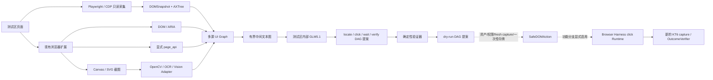

# KT6 多源 UI Graph 架构

## 目标与开源参考边界

本方案把页面感知结果先转换为有来源、可审计的中间文本图，再交给测试区内的
GLM5.1 生成结构化操作计划。这样既保留现有 OpenCV/OCR 对 Canvas、图片和文本的
覆盖，也为 DOM、无障碍树和页面显式 API 提供统一结构。

[TextFlow](https://github.com/JunyiYe/TextFlow) 以 MIT License 发布；KT6 参考的是
它的“输入 → 中间文本图表示 → 推理器”分层思路。KT6 没有把 TextFlow 当作 DOM
解析器，也不声称复用其 DOM 采集代码或模型。页面采集使用
[Playwright](https://github.com/microsoft/playwright)（Apache-2.0）连接 Chromium，
并通过 [Chrome DevTools Protocol](https://chromedevtools.github.io/devtools-protocol/)
读取 `DOMSnapshot.captureSnapshot` 和 `Accessibility.getFullAXTree`。

当前实现没有 OmniParser 路径。视觉来源仍由项目已有的 OpenCV/OCR、HTTP Vision
或其他受控适配器产生，再作为 `vision` / `text` 证据进入同一张图。

## 数据流



采集、建图、推理和执行彼此隔离：模型只提出计划，不能修改 UI Graph、授予点击
权限或调用浏览器输入接口。

## UI Graph 契约

UI Graph 使用 `kt6.ui-graph.v1`。每个节点都有稳定 `id`，并保留以下信息：

- `source.kind`：`dom`、`cdp`、`page_api`、`vision` 或 `text`；不同来源的观察保留为
  独立节点，再通过业务对象、动作和语义边建立关联，避免静默融合。
- 语义字段：role、name、text、业务对象、frame/document、bbox 等已知信息。
- `source.path` / `source_ref` / `method` / `trust`：记录采集方法、原始节点标识和
  信任级别，用于回溯与冲突审计；关系边另带 `provenance`。
- `interaction.candidate`：节点是否具备“值得尝试绑定”的交互特征。候选不等于
  当前可点击，更不等于已经授权。
- `can_click_now=false`、`safe_for_execution=false`：图本身始终不授予
  执行能力。

边表达结构和联动关系，包括：

| 边 | 含义 |
|---|---|
| `parent_of` | DOM、无障碍树或语义投影中的父子结构 |
| `owner_of` | 控件与其所属容器、frame 或业务对象的归属关系 |
| `claims_business_object` | 页面节点声称对应某业务对象；仍需权威资产源复核 |
| `supports_action` | 节点或业务对象与动作候选的关系 |
| `semantic_relation` | 视觉、文本或页面 API 给出的非执行语义关系 |

父子和 owner 边使后续操作可以先定位容器/设备，再在其作用域内定位控件，并通过
`depends_on` 与条件形成联动步骤。不同来源冲突时不静默覆盖，来源和问题会继续留在
图中。

## CDP 只读 Sidecar

`browser_sidecar/` 是测试区本地工具。它使用 `playwright-core` 连接已经启用调试
端口的 Chromium，只接受 loopback CDP 地址，不下载浏览器，也不调用点击、键盘、
网络拦截或 `Runtime.evaluate`。输出文件使用独占创建，避免覆盖旧证据。

```powershell
cd browser_sidecar
npm install
node .\capture-ui-graph.mjs `
  --cdp-url http://127.0.0.1:9222 `
  --page-url nce `
  --output .\cdp-snapshot.json
```

`--page-url` 是用于选择现有标签页的 URL 子串；省略时由 Sidecar 按其命令帮助所述
规则选择页面。生成的 `cdp-snapshot.json` 可作为页面采集请求中的 `cdp_snapshot`
提交给 KT6，后端会将 DOMSnapshot 与 AXTree 按 `frame_id + backend_node_id` 合并，
并作为 `cdp_perception` 保留。Sidecar 对 frame、DOM 和 AX 节点设上限；后端归一化
另对聚合节点和关系设上限。任一环节超限都会失败关闭，不会截掉安全关键结构后继续
声称快照完整。

调试端口只能在受控测试主机上显式开启。不要将它监听到非 loopback 地址，也不要
把原始快照复制到测试区外。

## 内部 GLM5.1 配置

UI Graph 推理默认关闭。只有测试区内配置了内部服务地址后，计划接口才会调用模型：

```powershell
$env:KT6_UI_GRAPH_REASONER_ENDPOINT = 'https://glm-gateway.example.internal/v1/ui-plan'
$env:KT6_UI_GRAPH_REASONER_ALLOWED_HOSTS = 'glm-gateway.example.internal'
$env:KT6_UI_GRAPH_REASONER_API_KEY = '<internal-token>'
$env:KT6_UI_GRAPH_REASONER_TIMEOUT_SECONDS = '60'
python -m kt6_backend.app
```

- `KT6_UI_GRAPH_REASONER_ENDPOINT`：必填的内部 GLM 网关；非 loopback 地址必须使用
  HTTPS，重定向会被拒绝。
- `KT6_UI_GRAPH_REASONER_ALLOWED_HOSTS`：非 loopback endpoint 必填；使用逗号分隔的
  精确主机名白名单，不接受通配符或 URL。推理客户端同时禁用系统 HTTP(S) 代理。
- `KT6_UI_GRAPH_REASONER_API_KEY`：可选的内部 Bearer Token，不会出现在健康检查中。
- `KT6_UI_GRAPH_REASONER_TIMEOUT_SECONDS`：可选超时秒数，必须为有限正数。

发送给 GLM 的内容是有界 UI Graph 文本、用户指令和固定输出契约。生产/测试页面
数据不发送给 Codex、公共大模型或外部 SaaS；endpoint 必须指向测试区内部 GLM5.1。
发送前会再生成模型专用的 UTF-8 字节有界投影，优先保留 DOM/CDP 交互候选、业务/动作
节点及其父链；若仍超预算则失败关闭。完整 UI Graph 仍保留在本地，不因模型预算截断。

## 计划 API

读取某次采集对应的图：

```text
GET /api/ui-graphs/{capture_id}
```

普通 capture 响应用 `ui_graph_ref` 代替完整 UI Graph，同时仍保留规范化后的
`cdp_perception` 供采集诊断。旧 Runtime 拓扑仅携带 `ui_graph_ref` 和
`cdp_perception_ref`，避免大图进入任务上下文反复深拷贝和事件序列化；完整 UI Graph
需要时通过上述专用接口按 capture 读取。

让内部 GLM 基于既有图提出操作 DAG：

```http
POST /api/ui-operations/plan
Content-Type: application/json

{
  "page_capture_id": "capture-...",
  "instruction": "定位 AP1，并在其操作区域找到关闭按钮后验证状态"
}
```

模型只允许提出四类步骤：`locate`、`click`、`wait`、`verify`。步骤通过唯一 ID、
`depends_on` 和受限条件对象组成 DAG；验证器拒绝循环依赖、未知节点、未知参数、
越界等待和不受信任的点击目标。reasoner 响应必须回显本次 `graph_id`，规划服务还会
校验图内 `capture_id` 与请求一致，并只允许引用本次实际发送给 GLM 的有界投影节点。
模型输入上限为 512 KiB UTF-8，响应上限为 64 KiB。

点击提案必须指向服务器 UI Graph 中 `interaction.candidate=true` 的可重绑定节点：
DOM 需有稳定 source ref，CDP 需有正整数 backend node ID；disabled、blocked 或
analysis-only 状态都会优先拒绝。`page_api`、`vision`、`text` 只能参与结构推理和
定位，不能让点击提案通过验证。即使验证通过，响应仍固定包含：

```json
{
  "dry_run_only": true,
  "safe_for_execution": false
}
```

这表示“计划结构可供检查”，不表示“可以点击”。`feature/browser-executor` 另行实现
click-only 执行试验：只有资产/控件绑定、权限/用户确认、fresh capture、目标指纹和
一次性令牌全部通过后，`UIGraphTargetResolver` 才把同一图中的 CDP 候选解析成
backend node id，交给 Browser Harness 取 box center 并点击。图和 DAG 的安全字段仍不
改变；执行授权来自 SafeDOMAction，不来自模型或 UI Graph。执行瞬间还会固定调用
`Page.getFrameTree`、`DOM.describeNode` 和 `DOM.getNodeForLocation`，重新核对 frame、
`id/owner/action` 与中心点命中目标，避免 stale node 或 overlay 截获点击。

Browser Harness 仅承担 daemon、CDP transport 和坐标点击，不接收任意 CDP 方法、JS
或模型生成代码，也不启用自修改 helper/domain skill。专用 E2E harness 只额外使用一组
写死的 CDP 采集/页面重置方法，不向 Planner 或执行 API 暴露。点击回执只说明事件已
派发，计划进入 `executed_pending_verification`；必须用新的 KT6 capture 调用确定性
OutcomeVerifier，进入 `verified` 后才能判定成功。第一阶段保留现有 Playwright/CDP
只读 Sidecar，不合并感知连接。

## 安全边界与运维检查

- Sidecar、KT6 后端和 GLM5.1 都部署在测试区内，数据不越区。
- 页面内容和模型输出都按不可信数据处理；模型响应经过严格 JSON、大小、字段、
  节点引用和 DAG 校验。
- `source`、父子关系和业务对象声明只是证据。资产授权继续以服务端权威资产源为准。
- UI Graph 规划接口不调用点击，也不复用页面内容中的脚本或网络请求。
- 未配置 reasoner、找不到 capture/graph、来源不可信或图被截断时均应明确拒绝，
  不能回退为坐标猜测。

上线前至少分别验证：CDP 真实页面采集、跨 frame 父子关系、DOM/CDP 候选门禁、
GLM 非法 DAG 拒绝、内部 endpoint 的 TLS/超时，以及现有 DOM 安全动作链没有被绕过。

## 相关实现

```text
browser_sidecar/                 Playwright/CDP 只读采集工具
kt6_backend/cdp_snapshot.py      DOMSnapshot + AXTree 规范化
kt6_backend/ui_graph.py          多源 UI Graph 构建与文本序列化
kt6_backend/ui_graph_reasoner.py 内部 GLM HTTP 契约
kt6_backend/ui_operation_graph.py 操作 DAG 严格校验
kt6_backend/ui_graph_planning.py 建图、推理与验证的 dry-run 服务
kt6_backend/execution/          Browser Harness、Fixture Planner、目标重绑定与结果验证
kt6_backend/execution/live_page_capture.py 固定 CDP 方法的真实测试页采集适配
kt6_backend/execution_e2e_cli.py 真实页面 DOM 闭环的一键运行入口
kt6_backend/safe_dom_actions.py 资产/权限/fresh capture/令牌门禁、执行和验证状态
demo/execution-test.html        DOM + Canvas 真实测试页面
```
